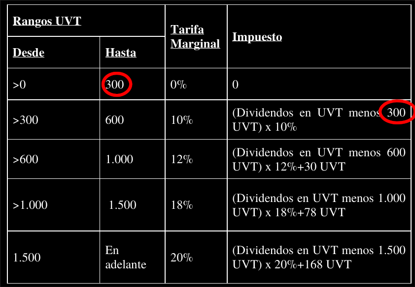

I discovered the inconsistencies in the process of translating the law to Python code.


# The dividend tax schedule

Let's start with the part of the law where I found no inconsistencies, which is the dividend tax. Here's what that looks like in the proposal:


Translated to python, that looks like this:

```
def dividendTax (x):
  return        ( 0                    if x <= 300
    else        ( (x - 300 )*0.1       if x <= 600
      else      ( (x - 600 )*0.12 + 30 if x <= 1000
        else    ( (x - 1000)*0.18 + 78 if x <= 1500
          else  ( (x - 1500)*0.2  + 168 ) ) ) ) )
```

(You can ignore the words "def" and "return".) What that says is that if someone's dividend income is less than 300 uvts, they pay no dividend tax. If it's not less than 300 but it's less than 600 uvts, then they pay 10% tax on the portion of their dividend income in excess of 300 uvts. If their dividend income is not less than 600 uvt but it's less than 1000 uvt, they pay 18% on the portion above 600, and they also pay 30 uvt for the first 600. Etc.

There are a couple important patterns in that. First, notice how 300 appears at the end of the first line and at the beginning of the second, 600 appears at the end of the second line and the beginning of the third, etc. This pattern is common to tax schedules. Its purpose is to make sure that every peso you earn is taxed by at most one rate. It subtracts the pesos that were already taxed at lower rates.

The same pattern appears in the proposal:

.

The second pattern is a little more complicated, but still simple: If you plug in the maximum amount of income that could be taxed in any row, the result is the amount that is added to someone's taxes in the next row. For instance, in the first row, if you plug in 300, you get 0. So 0 is added to (x-300)*0.1 in the second row. In the second row, if you plug in 600, you get 30, and 30 is the amount added in the third row. Etc.

Again, the same pattern appears in the proposal:

.

The dividend tax proposed follows these rules perfectly. The others do not.


# The inheritance tax

The inheritance schedule comes with a helpful column indicating the intended marginal tax rate.

```
def inheritanceTax_intended(x):
  return     (  0                          if x <  112337
    else     ( (x -  112337)*0.1           if x <  280884
      else   ( (x -  280884)*0.2  +  16855 if x < 2808436
        else ( (x - 2808436)*0.33 + 522365 ) ) ) )

def inheritanceTax_written(x):
  return     ( 0                           if x <  112337
    else     ( x            *0.1           if x <  280884
      else   ( (x -  280884)*0.2  +  28084 if x < 2808436
        else ( (x - 2808436)*0.25 + 533594 ) ) ) )
```


# The wealth tax

```
def wealthTax_intended(x):
  return             (0                                if x <   84253
    else             ( (x -   84253)*0.01              if x <  140422
      else           ( (x -  140422)*0.015 + 561.69    if x <  280844
        else         ( (x -  280844)*0.02  + 2668.0198 if x <  702109
          else       ( (x -  702109)*0.025 + 11093.319 if x < 1404218
            else     ( (x - 1404218)*0.03  + 28646.043 if x < 2106327
              else   ( (x - 2106327)*0.035 + 49709.313 if x < 2808437
                else ( (x - 2808437)*0.04  + 74283.164 ) ) ) ) ) ) ) )

def wealthTax_written(x):
  return             (  0                            if x <   84253
    else             ( (x -    13500 )*0.01          if x <  140422
      else           ( (x -   140422 )*0.015 +  1269 if x <  280844
        else         ( (x -   280843 )*0.02  +  3376 if x <  702109
          else       ( (x -   969796 )*0.025 + 11801 if x < 1404218
            else     ( (x -  1685061 )*0.03  + 29354 if x < 2106327
              else   ( (x -  2106327 )*0.035 + 50417 if x < 2808437
                else ( (x - 14042183 )*0.04  + 74990 ) ) ) ) ) ) ) )
```
