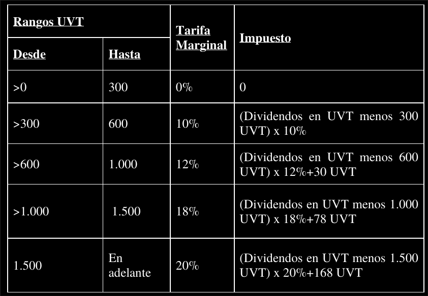
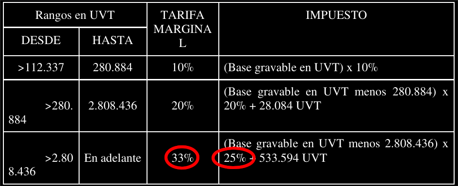

# The dividend tax schedule

Let's start with the part of the law where I found no inconsistencies, which is the dividend tax. Here's what that looks like in the proposal:



What that says is that if someone's dividend income is less than 300 uvts, they pay no dividend tax. If it's not less than 300 but it's less than 600 uvts, then they pay 10% tax on the portion of their dividend income in excess of 300 uvts. If their dividend income is not less than 600 uvt but it's less than 1000 uvt, they pay 18% on the portion above 600, and they also pay 30 uvt for the first 600. Etc.

There are a couple important patterns in it.

## Pattern 1: Subtract the top of the previous bracket from the income subject to the current bracket.

Notice how the 300 in the "hasta" column of the first row is subtracted from income in the formula ("impuesto") column of the second row:

.

Similarly, the 600 from the second row appears in the formula for the third row, etc. This pattern is common to tax schedules. Since each peso earned should be taxed by exactly one rate (maybe zero), the pesos that were taxed at earlier rates are subtracted from income when the next rate is applied.

## Pattern 2: Add the maximum payable tax leviable by the previous bracket to the tax dictated by the current bracket.

If you plug in the maximum amount of income that could be taxed in any row, the result is the amount that is added to someone's taxes in the next row. For instance:


If you plug 600 into the second row, you get 30, and 30 is the amount added in the third row. If you plug 1000 into the third row, you get 78, which is the amount added in the fourth row. Etc. (In the first row, if you plug in 300, you get 0, which is why nothing is added in the formula for the second row.)

The dividend tax proposed follows these rules consistently. The others do not.


# The inheritance tax

There are two problems with the proposed inheritance tax schedule. The first is that the biggest inheritances are not in fact being taxed at a 33% rate, as suggested by the "Tarifa Marginal" column, but rather just 25%:



The second is that the `112337` from the first row should be subtracted from `x` in the second row:


Without this, we have the strange result that if someone inherits `112336` UVTs, they pay no inheritance tax, but if they inherit `112338` UVTs, they lose 10% of their entire inheritance to taxes.


## Graphing the inheritance tax

If we plot the fraction of an inheritance taken by taxes as dictated by the proposal's formulas, we get this:


If we plot the same quantity as suggested by the proposal's rates and thresholds, we get this:


# The personal wealth tax

The weatlh tax schedule gives a uniform, intuitive set of marginal rates, starting at 1% and progressing up to 4%. However, the formulas dictating total tax owed as a function of those rates appear to be incorrect.

Their first inconsistency is in Pattern 1. It is only followed about half the time. The circles in the picture below indicate where it *is* followed:


The most pronounced effect of this pattern not being followed is in the highest personal wealth bracket:


If you plug 3.000.000 into the formula proposed, the resulting tax is actually negative:
```
(3000000 - 14042183 )*0.04  + 74990 = -366697.32
```

In fact, for any level of wealth below 12167433 UVTs, the tax levied by the formula. If your wealth was exactly 12167433 UVT, you would owe 0 in taxes. If your wealth was (12167433 + 100) UVT greater than that number, you would owe 4 UVT in taxes. Meanwhile someone whose wealth was much lower than yours, 2808436 UVTs, would owe 74990 in taxes.

It looks like Congress intended to implement the following marginal rate schedule:

| From    | To      | Rate |
| --      | --      | --   |
| 0       | 84253   | 0%   |
| 84253   | 140422  | 1%   |
| 140422  | 280844  | 1.5% |
| 280844  | 702109  | 2%   |
| 702109  | 1404218 | 2.5% |
| 1404218 | 2106327 | 3%   |
| 2106327 | 2808437 | 3.5% |
| 2808437 | infinity| 4%   |

If so, then the table in the proposal should look like this:

| Límite inferior         | Límite superior | Tarifa                                           |
| --                      | --              | --                                               |
| Mayor o Igual a   84253 | Menor a  140422 | Patrimonio menos 84253 UVT * 1%                  |
| Mayor o Igual a  140422 |          280844 | Patrimonio menos  140422 UVT * 1.5% + 562   UVTs |
| Mayor o Igual a  280844 |          702109 | Patrimonio menos  280844 UVT * 2%   + 2668  UVTs |
| Mayor o Igual a  702109 |         1404218 | Patrimonio menos  702109 UVT * 2.5% + 11093 UVTs |
| Mayor o Igual a 1404218 |         2106327 | Patrimonio menos 1404218 UVT * 3%   + 28646 UVTs |
| Mayor o Igual a 2106327 |         2808437 | Patrimonio menos 2106327 UVT * 3.5% + 49709 UVTs |
| Mayor o Igual a 2808437 |        ifninito | Patrimonio menos 2808437 UVT * 4%   + 74283 UVTs |


## Graphing the personal wealth tax

If we plot the fraction of an personal wealth taken by taxes as dictated by the proposal's formulas, we get this:


Two strange propoerties stand out: (1) Sometimes, a richer person pays less than a poorer person does in taxes. In fact that's true even if we measure in pesos, rather than as a fraction of their income. (2) For certain large personal wealth values, the tax formulas imply a negative tax.

The schedule suggested by the rates and thresholds in the proposal, as described above, would yield the following alternative:


# The corporate wealth tax

The most immediate problem with the corporate wealth tax proposed is that it's progressive. Progressive taxes make sense for individuals but they have [unwanted effects when levied on coroporations](https://economic-incentives.blogspot.com/2010/02/why-isn-corporate-income-tax.html).

But supposing Congress does in fact want to impose a progressive corporate wealth tax, the schedule provided in the proposal does not follow Pattern 1 in two places:


In both cases, the number in red on the right hand side should probably be changed to equal the number on the left. Here's the effect without that change:


We see the same two problems here that we saw in the personal wealth tax formulas. For one thing, the fraction of profits taxed is *negative* for a large range of extremely profitable companies. For another, some wealthier corporations pay less tax than less wealthy ones, both as a fraction of their profits and in absolute numbers of pesos.

Here's the same graph after the two changes proposed above:


